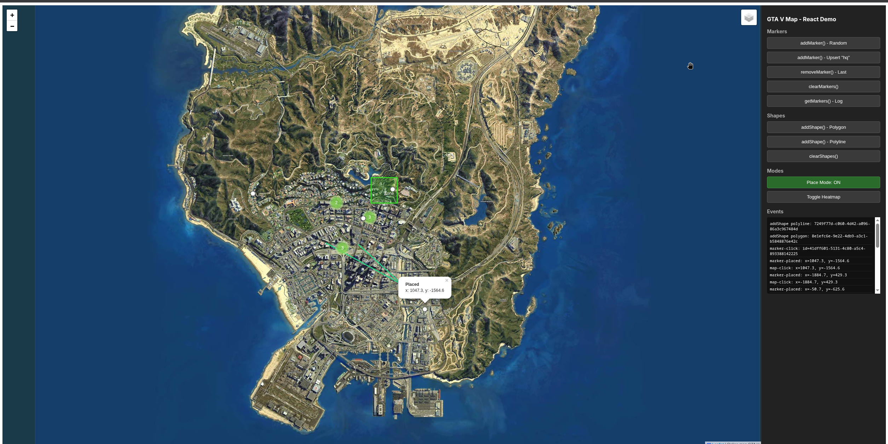
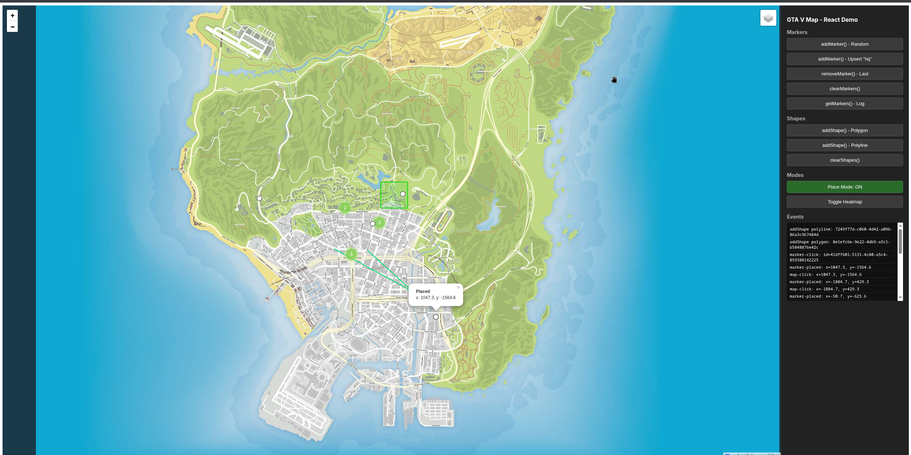
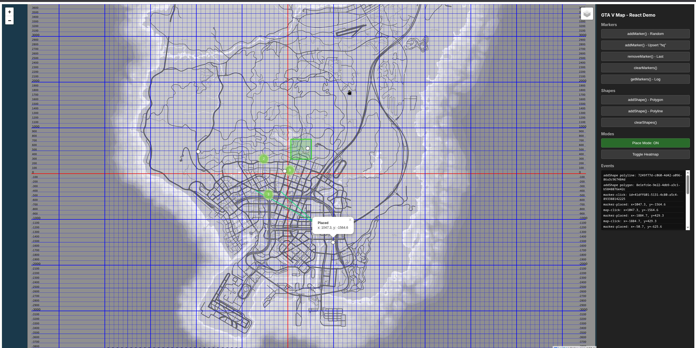

# GTA V Map Web Component

A Lit-based web component that renders an interactive GTA V map using Leaflet. Works in **vanilla HTML**, **React**, and **Angular**.

## Features

- Configurable tile layers (Satellite, Atlas, Grid)
- Custom markers with groups and HTML popups
- Marker clustering (via leaflet.markercluster)
- Polylines and polygons with centered labels
- Heatmap layer from marker density
- Click-to-place mode
- Custom CRS support
- CSP-safe (no `unsafeCSS`)
- Full imperative API + declarative attributes
- Zero runtime dependencies (everything bundled)

## Quick Start

```html
<gta-v-map
  zoom="3"
  default-style="satellite"
  tile-base-url="/mapStyles"
  blips-url="/blips"
  show-layer-control
  markers='[{"x": 0, "y": 0, "icon": 1, "popup": "Hello!"}]'
></gta-v-map>
```

```js
import 'gta-v-map';

const map = document.querySelector('gta-v-map');
map.addMarker({ x: 100, y: 200, icon: 1, popup: '<b>Dynamic</b>' });
```

## Map Styles

The component supports three built-in tile styles:

| Satellite | Atlas | Grid |
|:---------:|:-----:|:----:|
|  |  |  |

Set the initial style with the `default-style` attribute:

```html
<gta-v-map default-style="satellite"></gta-v-map>
```

## Sections

- [Installation](./getting-started/installation)
- [Configuration](./getting-started/configuration)
- [API Reference](./api/properties)
- [Framework Guides](./frameworks/vanilla)
